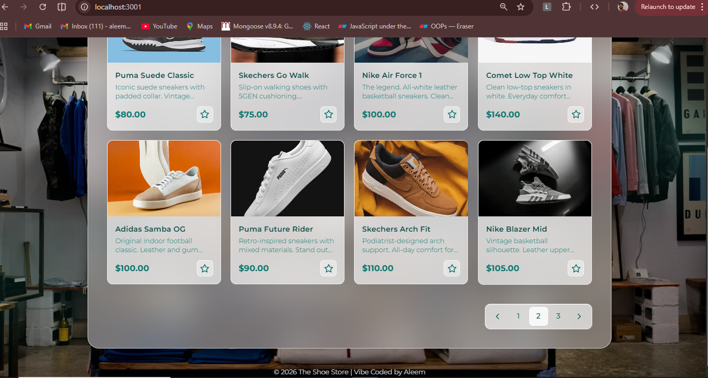

# Vibe Dashboard

Full-stack app: Express API + Next.js 14 (App Router) with glassmorphism UI, debounced search, and responsive card layout.

## Installation

### Backend

```bash
cd backend
npm install
cp .env.example .env   # optional; PORT defaults to 5000
```

### Frontend

```bash
cd frontend
npm install
cp .env.example .env   # optional; API URL defaults to http://localhost:5000
```

## Run

**Terminal 1 – API**

npm start

**Terminal 2 – Frontend**

cd frontend
npm run dev
```

App runs at `http://localhost:3000`.

## Project structure

```
vibe-dashboard/
├── backend/
│   ├── data/
│   │   └── items.js          # In-memory items
│   ├── routes/
│   │   └── items.js          # GET /api/items?search=term
│   ├── .env.example
│   ├── package.json
│   └── server.js
├── frontend/
│   ├── app/
│   │   ├── globals.css
│   │   ├── layout.tsx
│   │   └── page.tsx
│   ├── components/
│   │   ├── EmptyState.tsx
│   │   ├── ErrorState.tsx
│   │   ├── ItemCard.tsx
│   │   ├── LoadingSpinner.tsx
│   │   └── SearchInput.tsx
│   ├── hooks/
│   │   └── useDebounce.ts
│   ├── lib/
│   │   └── api.ts            # Axios API client
│   ├── .env.example
│   ├── next.config.js
│   ├── package.json
│   ├── postcss.config.js
│   ├── tailwind.config.ts
│   └── tsconfig.json
└── README.md
```

## Images

Below are some visual examples showing the dashboard functionality:


*Dashboard overview with item cards, search, and pagination.*


*Search functionality in action.*


*Empty state when no items match the search.*

> Images are located in the `Images/` folder. Add your own screenshots for more examples.

## API
  Returns all items.
  Returns items whose `name` contains `term` (case-insensitive).

Response: `{ "items": [{ "id", "name", "description", "price" }, ...] }`
